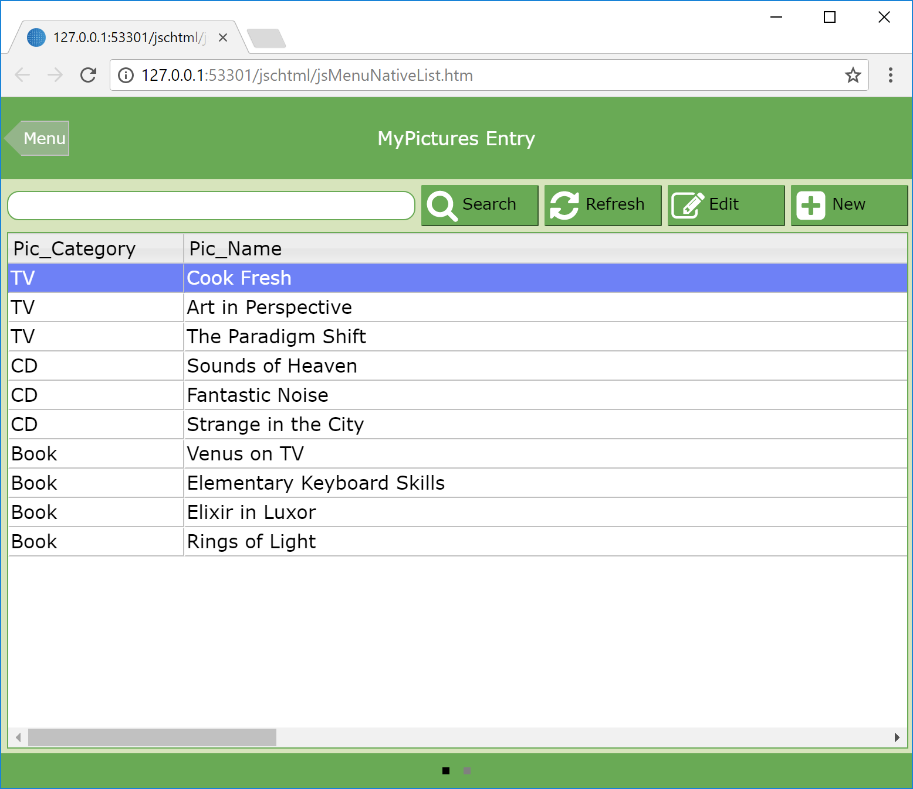

# Omnis-PicturesDB
For Omnis Studio 8.1 and above.

Sample application generated using the App Builder via New Library|Sample Database|Pictures showing both Desktop and Responsive Web Forms, Navigation and Reports.
Screenshot

## Contents

This repository includes the following:

### PICTURESDB

This folder contains the source JSON files for the Omnis library in Github.

To restore these files in Omnis Studio, click on the Libraries option in the Studio Browser, and click on the New Lib from JSON option. In the New Library (import) dialog, navigate to this source folder (containing library.json), and then specify a different folder or location for the new Library. Click on Import and open the library in the Studio Browser.

### pics.db

A sqlite database as used by the library. Once the above source has been imported, place this file in the same location as your library. 

Open the Startup_task of your imported library and use the newly installed menu (toolbar on macOS) to access via both desktop and web forms. 
